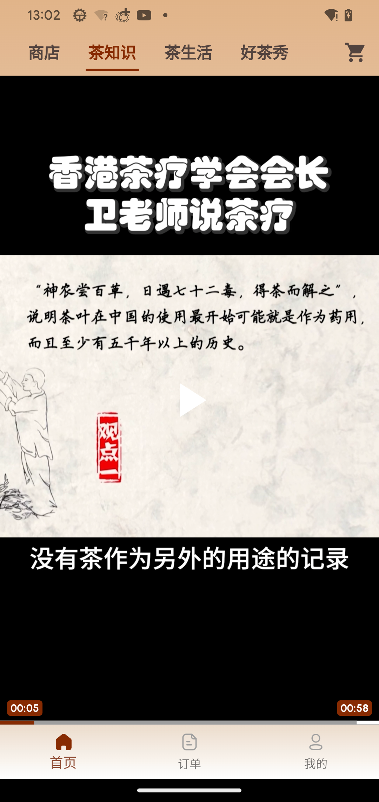
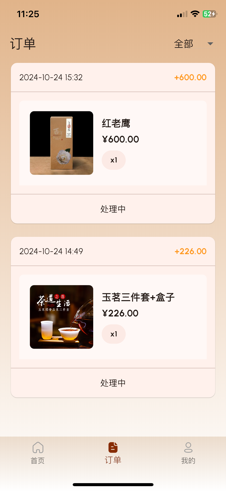
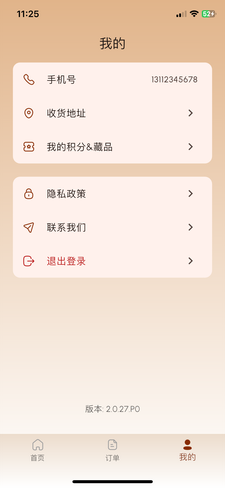
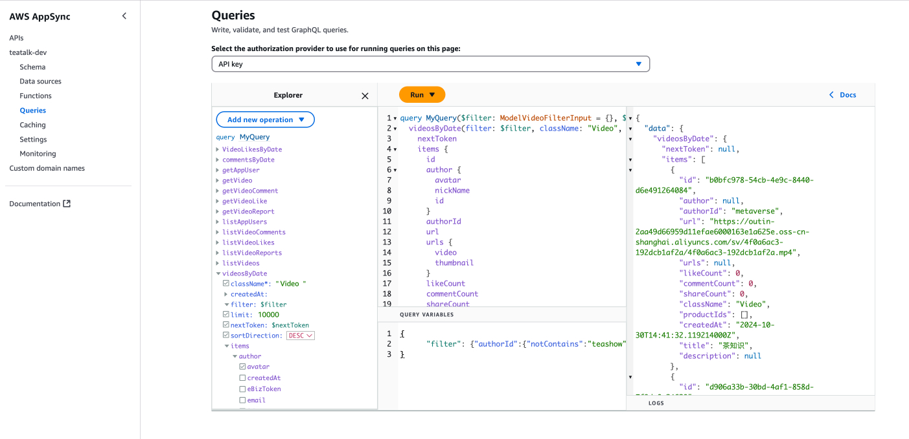
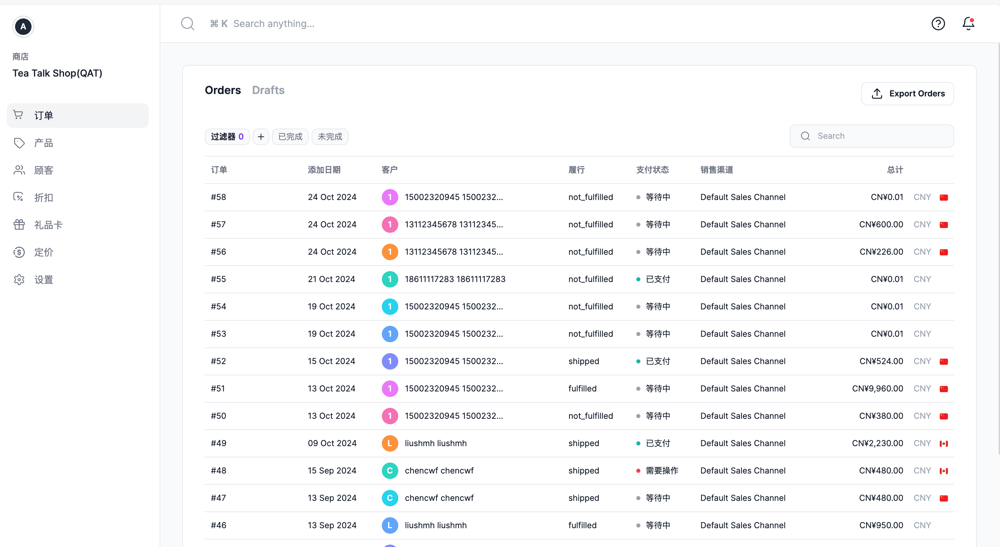
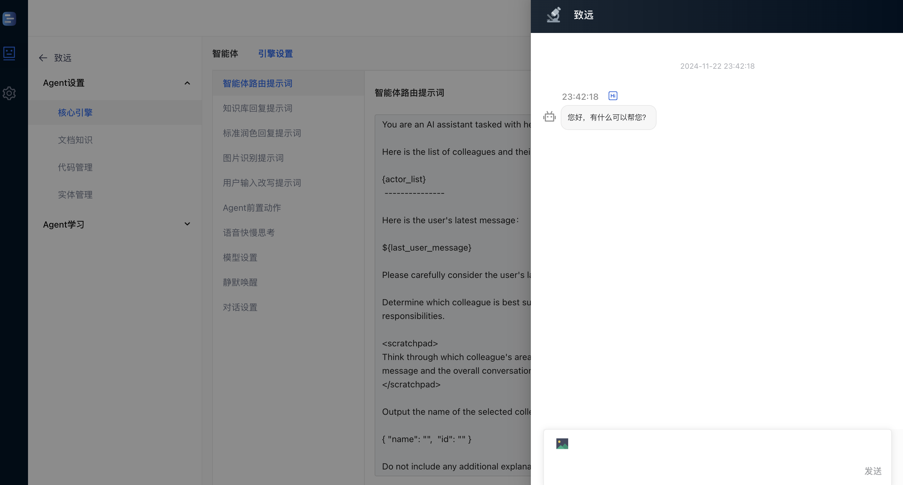
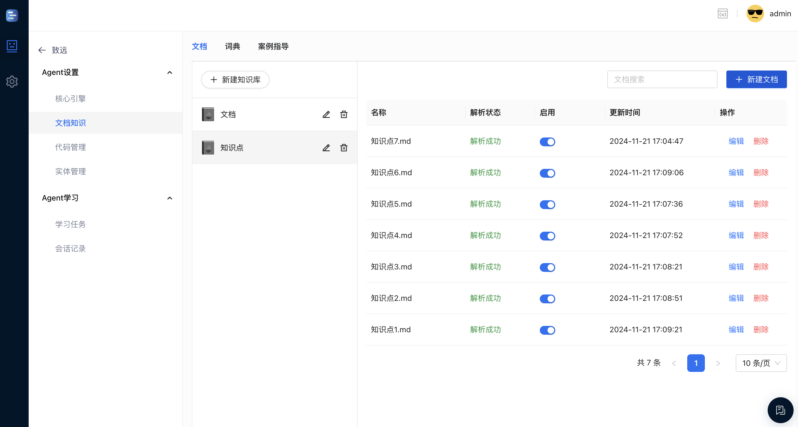
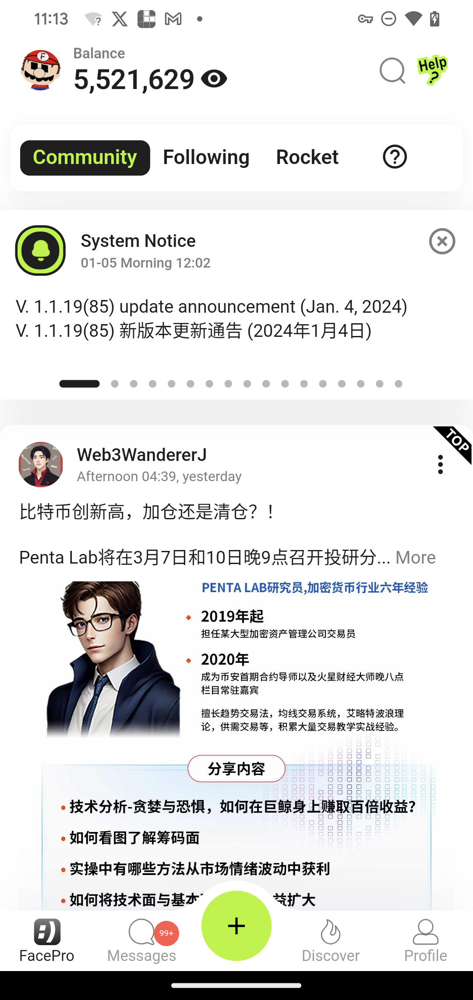
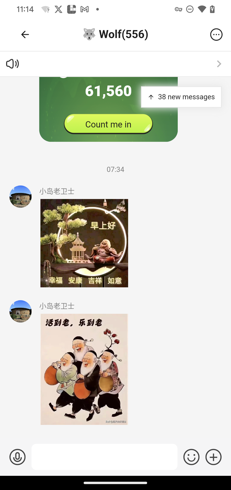
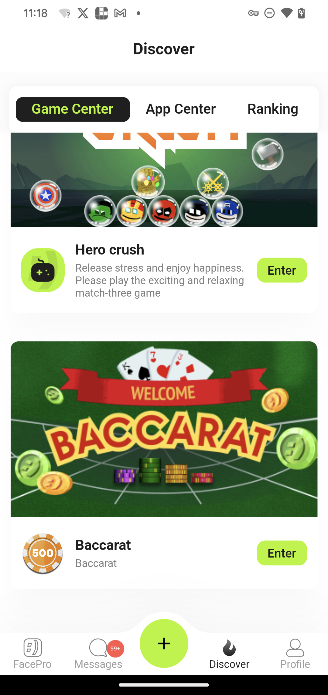

陈万飞
======

#### 1979年生, 男, 全栈软件工程师，现居重庆

联系方式
---------
- Email: [chenwf@gmail.com](chenwf@gmail.com)
- [Medium](https://medium.com/@chencwf)
- [微博](https://weibo.com/jagie)

教育经历
---------

**计算数学与应用软件学士, 中南大学** (1997-2001)

工作经历
---------
**独立开发者, 自由职业** (2009年-至今 重庆)

- 承接各种软件开发项目，有python爬虫, app开发, web开发, unity游戏等等

- 自行在App Store发布App

**软件工程师** (2001年-2008年 北京)
在多个软件工程师担任软件工程师

技能
------
**熟悉UI/UX设计:**
- 熟悉Material Design 3设计规范, 熟悉Figma等设计工具

**前端Flutter开发:**
- 熟悉Dart语言高级特性;
- 熟悉Flutter的内部机制;
- 熟悉从figma到Flutter theme的转换;
- 精通Provider状态管理，能建立一个清晰且健壮的app架构;
- 精通常用的各种packages, 且可以自由裁剪;
- 具备多年的Android/iOS原生开发经验, 熟悉Flutter与原生混合开发;
- 擅长在Futter中采用Firebase/amplify等serverless backend 方案;

**前端React开发:**
- 熟悉Typescript;
- 熟悉React;
- 熟悉Ant Design;

**前端游戏开发:**
- 熟悉C#和Unity;
- 擅长Unity和原声App,Flutter整合

**后端开发:**
- 熟悉Python，熟悉Selenium/Flask等packages;
- 熟悉LangChain/Ollama等Python packages进行RAG，可自行构建AI应用;
- 熟悉Shelf dart server框架
- 熟悉Aws Lambda/GraphQL/Amplify/DynamoDB/S3等AWS服务
- 熟悉Firebase Cloud Functions/Firestore/Realtime Database/Storage等Firebase服务

**其他:**
- 熟悉Git/Linux
- 熟悉Github Actions等CI/CD流程
- 擅长Cursor IDE及各类常用插件，善用AI工具
- 有良好的英文阅读及沟通能力
-

典型案例
--------
- 51好茶: 一个基于Flutter的app, 整合电商和类似TikTok等视频内容。后端基于Amplify+Medusa 

我的职责：从figma到App Store上架，从前端Flutter开发到后端aws的开通/medusa的搭建，全部独立完成

- DeepFlow: 一个大型的AI web客服系统,前端基于react/ant design, 后端基于python/flask/langchain/各家llm模型

我的职责：大部分前端React开发

- FacePro: 一个基于Flutter的 web3 social app,后端基于DymamoDB/GraphQL/Lambda/S3等AWS服务

我的职责：作为App端的开发负责人，负责了App的架构搭建，并且开发了内嵌的Unity游戏
