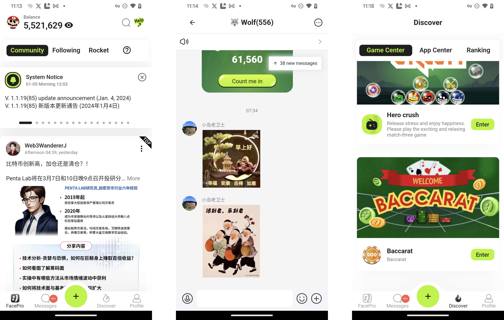
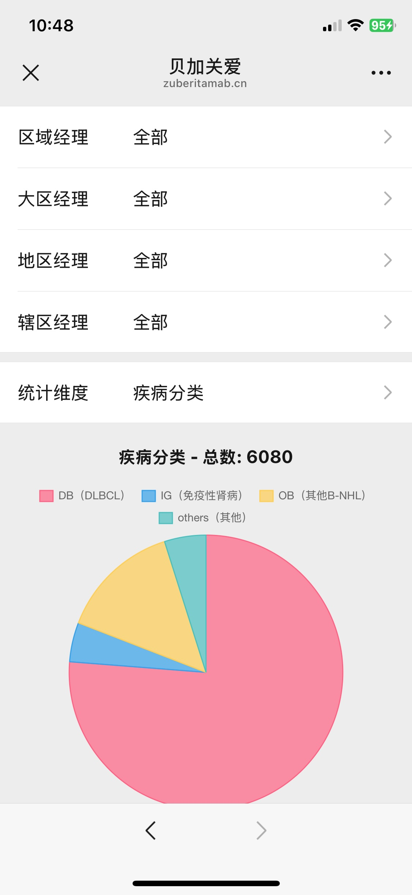

陈万飞
======

####男, 全栈软件工程师，现居重庆

&nbsp;

&nbsp;

联系方式
---------
- Email: [chencwf@gmail.com](chencwf@gmail.com)
- [Medium](https://medium.com/@chencwf)
- [微博](https://weibo.com/jagie)
- [github](https://github.com/Heilum)

教育经历
---------

**计算数学与应用软件学士, 中南大学** (1997-2001)

工作经历
---------
**独立开发者, 自由职业** (2009年-至今 重庆)

- 承接各种软件开发项目，有python爬虫, app开发, web开发, unity游戏等等

- 自行在App Store发布App

**软件工程师** (2001年-2008年 北京)
在多个公司任软件工程师

技能
------
**熟悉UI/UX设计:**
- 熟悉Material Design 3设计规范, 熟悉Figma等设计工具

**前端Flutter开发:**
- 熟悉Dart语言高级特性;
- 熟悉Flutter的内部机制;
- 熟悉从Figma到Flutter theme的转换;
- 精通MVVM 清晰架构;
- 精通常用的各种packages, 且可以自由裁剪;
- 具备多年的Android/iOS原生开发经验, 熟悉Flutter与原生混合开发;
- 擅长在Futter中采用Supabase/Firebase/amplify等serverless backend 方案;

**Next.js开发:**
- 熟悉Typescript;
- 熟悉Next.js;
- 熟悉Material Design;

**前端游戏开发:**
- 熟悉C#和Unity;
- 擅长Unity和原生App,Flutter整合

**后端开发:**
- 熟悉Python，熟悉Selenium/Flask等packages;
- 熟悉LangChain/Ollama等Python packages进行RAG，可自行构建AI应用;
- 熟悉Shelf dart server框架
- 熟悉Aws Lambda/GraphQL/Amplify/DynamoDB/S3等AWS服务
- 熟悉Firebase Cloud Functions/Firestore/Realtime Database/Storage等Firebase服务
- 熟悉self-host Supabase

**其他:**
- 熟悉Git/Linux
- 熟悉Github Actions等CI/CD流程
- 擅长Cursor IDE及各类常用插件，善用AI工具
- 有良好的英文阅读及沟通能力
- 求知若渴，虚怀若谷
- 具备强烈的责任心

典型案例
--------

**FacePro**

一个基于Flutter的 web3 social app, 后端基于DynamoDB/GraphQL/Lambda/S3等AWS服务

App Store: https://apps.apple.com/us/app/facepro/id1659173018

我的职责：作为App端的开发负责人，负责了App的架构搭建，并且开发了内嵌的Unity游戏

**FaceTalk**

一个类似于twitter space的 flutter app, 后端基于声网/DynamoDB/GraphQL/Lambda/S3等AWS服务

App Store: https://apps.apple.com/us/app/facetalk-web3/id6463494315

我的职责：作为App端的开发负责人，负责了App的架构搭建，并且开发了内嵌的Unity游戏

**贝加关爱**

一个基于Nextjs+WeUI的微信公众号,后端基于Self-Hosted Supabase

我的职责：全栈开发