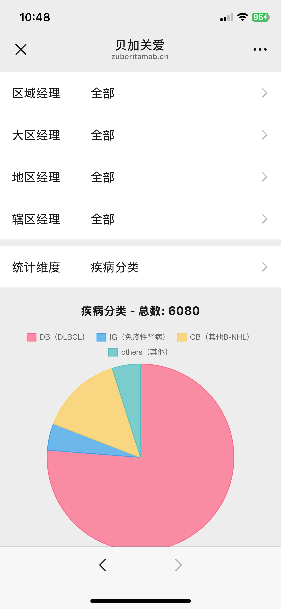

Chen Wanfei
======

#### Male, Full Stack Software Engineer, Based in Chongqing

&nbsp;

&nbsp;

Contact Information
---------
- [chencwf@gmail.com](mailto:chencwf@gmail.com)
- [Medium](https://medium.com/@chencwf)
- [Weibo](https://weibo.com/jagie)
- [github](https://github.com/Heilum)

Education
---------

**Bachelor of Computational Mathematics and Applied Software, Central South University** (1997-2001)

Work Experience
---------
**Independent Developer, Freelancer** (2009-Present, Chongqing)

- Undertake various software development projects, including Python crawlers, app development, web development, Unity games, etc.

- Published apps on App Store independently

**Software Engineer** (2001-2008, Beijing)
Worked as a software engineer in multiple companies

Skills
------
**Proficient in UI/UX Design:**
- Familiar with Material Design 3 specifications and design tools like Figma

**Frontend Flutter Development:**
- Proficient in advanced Dart language features
- Deep understanding of Flutter's internal mechanisms
- Experienced in converting Figma designs to Flutter themes
- Expert in MVVM app architectures
- Mastery of common packages with ability to customize
- Years of experience in native Android/iOS development, skilled in Flutter hybrid development
- Proficient in implementing serverless backend solutions like Supabase/Firebase/Amplify in Flutter

**Frontend Next.js Development:**
- Proficient in TypeScript
- Proficient in Next.js
- Proficient in Ant Design

**Frontend Game Development:**
- Proficient in C# and Unity
- Skilled in integrating Unity with native Apps and Flutter

**Backend Development:**
- Proficient in Python, familiar with packages like Selenium/Flask
- Experienced with LangChain/Ollama Python packages for RAG, capable of building AI applications
- Proficient in Shelf dart server framework
- Experienced with AWS services including Lambda/GraphQL/Amplify/DynamoDB/S3
- Experienced with Firebase services including Cloud Functions/Firestore/Storage

**Others:**
- Proficient in Git/Linux
- Familiar with CI/CD processes like Github Actions
- Skilled in Cursor IDE and various plugins, proficient with AI tools
- Strong English reading and communication skills
- Eager to learn, humble in approach
- Strong sense of responsibility

Featured Projects
--------
**FacePro**

A Flutter-based Web3 social app, backend based on AWS services including DynamoDB/GraphQL/Lambda/S3

My Role: As the App development leader, responsible for app architecture and development of embedded Unity games

**FaceTalk**

A Twitter Space-like Flutter app, backend based on Agora/DynamoDB/GraphQL/Lambda/S3 and other AWS services

My Role: As the App development leader, responsible for app architecture and development of embedded Unity games

**BeijiaGuanai**

A WeChat official account based on Next.js + WeUI, backend based on self-hosted Supabase

My Role: Full-stack development
