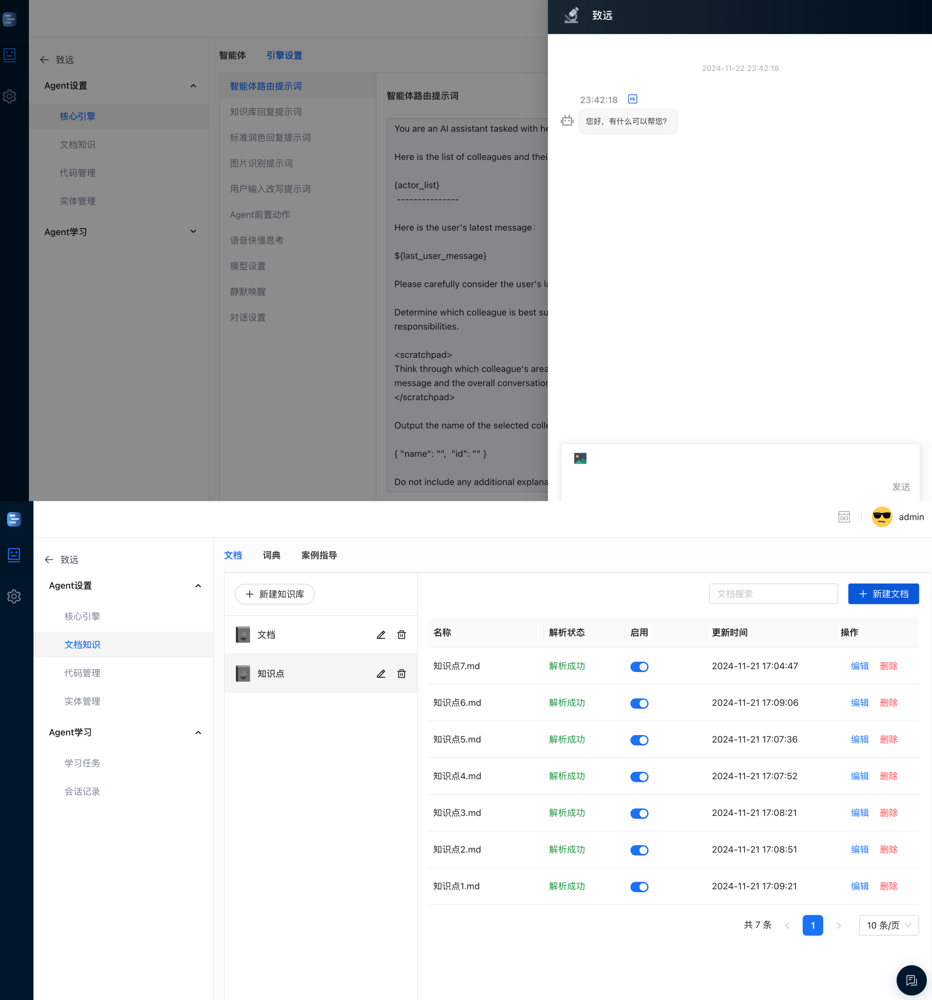
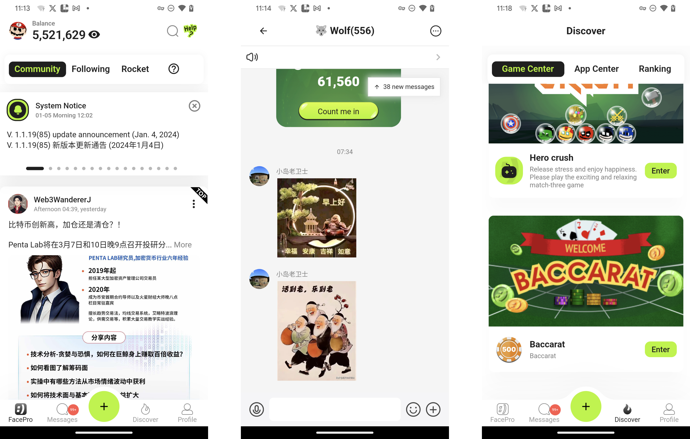

Chen Wanfei
======

#### Born in 1979, Male, Full Stack Software Engineer, Based in Chongqing

Contact Information
---------
- [chenwf@gmail.com](mailto:chenwf@gmail.com)
- [Medium](https://medium.com/@chencwf)
- [Weibo](https://weibo.com/jagie)

Education
---------

**Bachelor of Computational Mathematics and Applied Software, Central South University** (1997-2001)

Work Experience
---------
**Independent Developer, Freelancer** (2009-Present, Chongqing)

- Undertake various software development projects, including Python crawlers, app development, web development, Unity games, etc.

- Published apps on App Store independently

**Software Engineer** (2001-2008, Beijing)
Worked as a software engineer in multiple companies

Skills
------
**Proficient in UI/UX Design:**
- Familiar with Material Design 3 specifications and design tools like Figma

**Frontend Flutter Development:**
- Proficient in advanced Dart language features
- Deep understanding of Flutter's internal mechanisms
- Experienced in converting Figma designs to Flutter themes
- Expert in Provider state management, capable of building clear and robust app architectures
- Mastery of common packages with ability to customize
- Years of experience in native Android/iOS development, skilled in Flutter hybrid development
- Proficient in implementing serverless backend solutions like Firebase/Amplify in Flutter

**Frontend React Development:**
- Proficient in TypeScript
- Proficient in React
- Proficient in Ant Design

**Frontend Game Development:**
- Proficient in C# and Unity
- Skilled in integrating Unity with native Apps and Flutter

**Backend Development:**
- Proficient in Python, familiar with packages like Selenium/Flask
- Experienced with LangChain/Ollama Python packages for RAG, capable of building AI applications
- Proficient in Shelf dart server framework
- Experienced with AWS services including Lambda/GraphQL/Amplify/DynamoDB/S3
- Experienced with Firebase services including Cloud Functions/Firestore/Realtime Database/Storage

**Others:**
- Proficient in Git/Linux
- Familiar with CI/CD processes like Github Actions
- Skilled in Cursor IDE and various plugins, proficient with AI tools
- Strong English reading and communication skills
- Eager to learn, humble in approach
- Strong sense of responsibility

Featured Projects
--------
**1. 51 Good Tea**

A Flutter-based app integrating e-commerce and TikTok-like video content. Backend based on Amplify+Medusa 

My Role: Independently completed everything from Figma to App Store launch, from Flutter frontend development to AWS backend setup and Medusa implementation

**2. DeepFlow** 

A large-scale AI web customer service system, frontend based on React/Ant Design, backend based on Python/Flask/LangChain/various LLM models

My Role: Major frontend React development

**3. FacePro**

A Flutter-based Web3 social app, backend based on AWS services including DynamoDB/GraphQL/Lambda/S3

My Role: As the App development leader, responsible for app architecture and development of embedded Unity games
